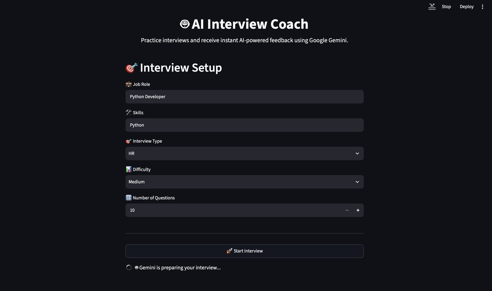
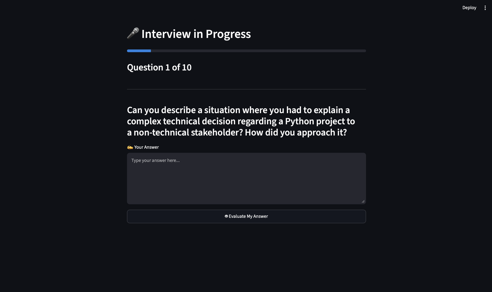
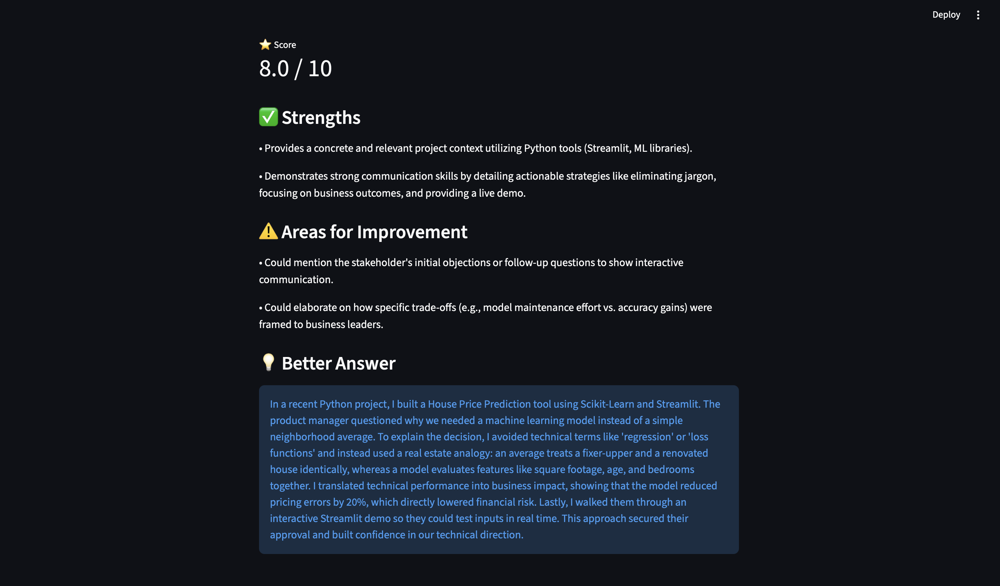

# 🤖 AI Interview Coach

An AI-powered interview preparation platform built with **Python, Streamlit, and Google Gemini**.

AI Interview Coach helps candidates prepare for interviews by generating personalized questions based on their **job role, skills, interview type, and difficulty level**. It also evaluates candidate answers using Gemini and provides **scores, strengths, improvement suggestions, and better answers**.

---

## ✨ Key Features

* 🎯 Personalized interview question generation
* 💼 Job-role based questions
* 🛠️ Skill-based question generation
* 📊 Easy, Medium, and Hard difficulty levels
* 🎤 Technical, Coding, HR, and Aptitude interview modes
* 🔢 Generate 10–20 interview questions
* 🤖 AI-powered answer evaluation
* ⭐ Candidate scoring
* 💡 Strengths and improvement suggestions
* 📝 AI-generated improved answers
* 🔐 Secure Gemini API key handling
* 🖥️ Interactive Streamlit interface

---

## 📸 Application Screenshots

### 🎯 Interview Setup



### 📝 Interview Questions



### 🤖 AI Evaluation



---

## 🧠 How It Works

```text
                 ┌──────────────────────┐
                 │      User Input      │
                 │                      │
                 │ Job Role             │
                 │ Skills               │
                 │ Interview Type       │
                 │ Difficulty           │
                 │ Number of Questions  │
                 └──────────┬───────────┘
                            │
                            ▼
                 ┌──────────────────────┐
                 │    Google Gemini     │
                 │   Question Generator │
                 └──────────┬───────────┘
                            │
                            ▼
                 ┌──────────────────────┐
                 │ Interview Questions  │
                 └──────────┬───────────┘
                            │
                            ▼
                 ┌──────────────────────┐
                 │   Candidate Answer   │
                 └──────────┬───────────┘
                            │
                            ▼
                 ┌──────────────────────┐
                 │    Google Gemini     │
                 │    AI Evaluator      │
                 └──────────┬───────────┘
                            │
                            ▼
                 ┌──────────────────────┐
                 │    AI Feedback       │
                 │                      │
                 │ Score                │
                 │ Strengths            │
                 │ Improvements         │
                 │ Better Answer        │
                 └──────────────────────┘
```

---

## 🛠️ Tech Stack

| Technology       | Purpose                                      |
| ---------------- | -------------------------------------------- |
| 🐍 Python        | Core programming language                    |
| 🎨 Streamlit     | Interactive web application                  |
| 🤖 Google Gemini | AI question generation and answer evaluation |
| 🔐 python-dotenv | Secure environment variable management       |
| 📦 JSON          | Structured data handling                     |
| 🌿 Git & GitHub  | Version control and project hosting          |

---

## 📂 Project Structure

```text
AI-Interview-Question-Generator/
│
├── app.py
├── gemini_generator.py
├── gemini_evaluator.py
├── requirements.txt
├── .env.example
├── .gitignore
├── README.md
│
├── data/
│   └── questions.json
│
└── screenshots/
    ├── interview_setup.png
    ├── interview_question.png
    └── ai_evaluation.png
```

---

## ⚙️ Installation

### 1. Clone the repository

```bash
git clone https://github.com/harini020306/AI-Interview-Question-Generator.git
```

```bash
cd AI-Interview-Question-Generator
```

### 2. Create a virtual environment

```bash
python3 -m venv venv
```

### 3. Activate the virtual environment

#### macOS / Linux

```bash
source venv/bin/activate
```

#### Windows

```bash
venv\Scripts\activate
```

### 4. Install dependencies

```bash
pip install -r requirements.txt
```

---

## 🔑 Gemini API Configuration

Create a `.env` file in the project root:

```text
GEMINI_API_KEY=your_api_key_here
```

**Never upload your real Gemini API key to GitHub.**

The `.env` file should remain excluded through `.gitignore`.

---

## ▶️ Run the Application

After activating the virtual environment, run:

```bash
streamlit run app.py
```

The application will open in your browser.

---

## 🎯 Example Workflow

```text
Enter Job Role
       ↓
Enter Skills
       ↓
Select Interview Type
       ↓
Select Difficulty
       ↓
Select Number of Questions
       ↓
Generate Questions
       ↓
Answer Questions
       ↓
AI Evaluation
       ↓
Score + Feedback + Better Answer
```

---

## 📊 AI Evaluation

The AI evaluator analyzes the candidate's response and provides:

### ⭐ Score

Evaluates the overall quality of the candidate's answer.

### 💪 Strengths

Identifies the concepts and aspects handled well.

### 💡 Improvements

Highlights missing concepts and areas that can be improved.

### 📝 Better Answer

Generates a clearer and more interview-ready version of the response.

---

## 🔐 Security

The project uses environment variables to protect the Gemini API key.

```text
.env
```

is intentionally excluded from GitHub.

Only the following example is provided:

```text
GEMINI_API_KEY=your_api_key_here
```

**Never commit or expose your actual API key.**

---

## 🚀 Future Enhancements

* 🎙️ Voice-based interviews
* 🗣️ Speech-to-text answers
* 📈 Interview performance dashboard
* 📊 Progress tracking
* 🧑‍💼 Resume-based question generation
* ⏱️ Timed interview mode
* 🏆 Interview history and analytics
* 🌐 Online deployment
* 📄 Automatic interview report generation

---

## 👩‍💻 Author

**Harini K.**

B.E. Electronics and Communication Engineering

Interested in **Artificial Intelligence, Machine Learning, Python, IoT, and Embedded Systems**

---

## ⭐ Support

If you find this project useful, consider giving the repository a ⭐ on GitHub.

